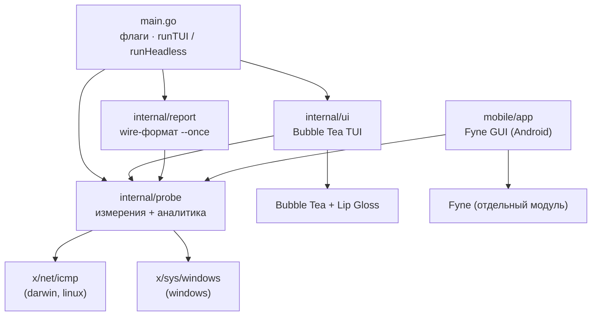
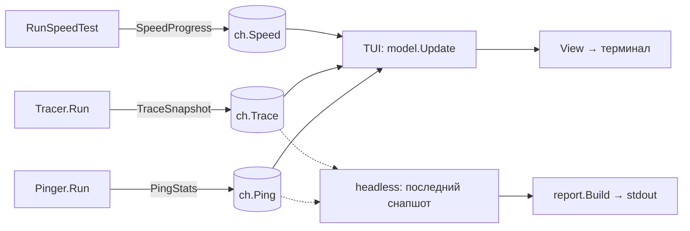

# Архитектура net-test

Технический обзор: структура кода, модель конкуренции, платформенный шов ICMP,
аналитика маршрута и one-shot отчёт. Пользовательская часть — в [README](../README.md).

## Принципы

1. **Сетевой слой не знает про UI.** `internal/probe` производит снапшоты
   (`PingStats`, `TraceSnapshot`, `SpeedProgress`) и шлёт их в каналы. Вся
   аналитика (аномалии, диагноз, ASN) тоже живёт здесь — UI и отчёт только
   отображают готовые поля. `probe` не импортирует ничего внутреннего, поэтому
   переиспользуется и в TUI (Bubble Tea), и в headless-режиме (`--once`), и в
   мобильном GUI ([mobile/app](../mobile/app) на Fyne) — без дублирования логики.
2. **Один платформенный шов.** Всё, что зависит от ОС, спрятано за интерфейсом
   `prober`. Остальной код собирается под любую платформу без правок.
3. **Без внешних бинарников и без root.** ICMP делается напрямую: unprivileged
   datagram-сокет на macOS/Linux, Win32-API `iphlpapi` на Windows. `os/exec`,
   `ping`, `traceroute` не используются.
4. **Ошибки не глотаются.** Сбой измерителя кладётся в поле `Err` снапшота,
   рисуется во вкладке и попадает в JSON-отчёт — процесс не падает молча.
5. **Отдельный wire-формат.** `internal/report` определяет собственные типы для
   `--once`/`--json`, чтобы JSON-контракт можно было эволюционировать независимо
   от внутренних структур `probe`.

## Структура пакетов



Направление зависимостей строго одностороннее: `main → {ui, probe, report}`,
`ui → probe`, `report → probe`, `mobile/app → probe`. `probe` не зависит ни от
чего внутреннего.

```
internal/probe/
  prober.go          # интерфейс prober + общие типы (нейтральный)
  prober_posix.go    # //go:build darwin || linux — udp4-сокет
  prober_windows.go  # //go:build windows — iphlpapi.IcmpSendEcho
  helpers.go         # экспортные IsLocalIP / ShortenASName / Millis
  ping.go            # Pinger: RTT/потери/джиттер + скользящее окно вердикта
  quality.go         # Quality: severity вердикта (потери/джиттер), общий для UI
  trace.go           # Tracer: mtr-стиль, пул проберов, dnsCache
  anomaly.go         # markAnomalies: persistent-vs-transient флаги хопов
  asn.go             # asnCache: ASN-обогащение через Team Cymru DNS
  diagnosis.go       # BuildDiagnosis: сегментация маршрута по зонам
  speed.go           # RunSpeedTest: Cloudflare down/up/latency
internal/report/
  report.go          # стабильный wire-формат + Build()
  text.go            # WriteJSON / WriteText
internal/ui/
  model.go           # модель Bubble Tea, Update, каналы, 4 вкладки
  views.go           # рендер вкладок (Пинг / Маршрут / Диагноз / Скорость)
  styles.go          # палитра, спарклайн, вердикт, бары
main.go              # флаги; runTUI (Bubble Tea) либо runHeadless (--once)
mobile/app/          # Fyne GUI (Android/desktop) — отдельный модуль; см. ниже
```

## Модель конкуренции

`Pinger.Run`, `Tracer.Run` и `RunSpeedTest` работают в отдельных горутинах и
пишут снапшоты в буферизованные каналы.

- **TUI** — однопоточный цикл Bubble Tea (Elm): команда `waitX` блокируется на
  `<-ch`, превращает значение в `tea.Msg`, а `Update` после обработки
  переподписывается тем же `waitX`.
- **Headless** (`--once`) — `runHeadless` копит последний снапшот каждого вида
  под мьютексом в течение `-duration`, затем (опц.) гоняет speed-тест и собирает
  отчёт через `report.Build`.



Каналы намеренно **не закрываются**: горутины живут весь сеанс, а `tea`/headless
снимают подписку через `ctx`. `emit()` ([ping.go](../internal/probe/ping.go)) —
дженерик-хелпер, который пишет в канал, но прерывается по `ctx.Done()`.

## Платформенный шов: `prober`

```go
type prober interface {
    probe(dst net.IP, ttl, seq int, timeout time.Duration) (probeResult, bool, error)
    close() error
}
func newProber() (prober, error) // своя реализация под каждый GOOS
```

`probe` синхронна: «отправь один echo с данным TTL, верни ответ или таймаут». Это
естественная модель и для Unix (send + read-match), и для Windows (request/reply
API). `ok == false` означает таймаут.

| | macOS / Linux / Android | Windows |
|---|---|---|
| Файл | `prober_posix.go` | `prober_windows.go` |
| Build tag | `darwin \|\| linux` | `windows` |
| Сокет/API | `icmp.ListenPacket("udp4", …)` | `iphlpapi.IcmpSendEcho` |
| Права | без root | без админки |
| TTL | `ipv4.PacketConn.SetTTL` | `IP_OPTION_INFORMATION.Ttl` |
| Матчинг ответа | по sequence-номеру¹ | сам API (request/reply) |
| Таймаут vs ошибка | timeout на чтении | `n==0` + errno: `IP_REQ_TIMED_OUT` → таймаут, иначе ошибка² |

¹ На Darwin ядро переписывает ICMP ID на порт сокета, поэтому ID ненадёжен —
матчим по seq. Для `Time Exceeded`/`Unreachable` seq достаётся из вложенного
исходного пакета (`innerSeq`).

² `IcmpSendEcho` при `n==0` различается по `GetLastError`: таймаут — это «нет
ответа» (`ok=false`), любой другой код — реальная ошибка, она пробивается в `Err`.

> На Windows датаграммный ICMP-сокет не поддерживается ОС, поэтому используется
> `iphlpapi` — тот же API, что у `ping.exe`/`tracert.exe`. Структуры
> `ICMP_ECHO_REPLY`/`IP_OPTION_INFORMATION` выверены по C-layout для 386 и amd64.

## Пинг (`ping.go`)

`Pinger.Run` раз в `interval` шлёт один echo с TTL 64 и ждёт ответ до `timeout`.
Снапшот содержит **две шкалы**:

- **За сессию** — `Sent`/`Recv`/`AvgRTT`/`BestRTT`/`WorstRTT`, джиттер RFC 3550
  (`J += (|RTTᵢ − RTTᵢ₋₁| − J) / 16`). Идёт в шапку вкладки.
- **Скользящее окно** — `WindowSize`/`WindowLossPct`/`WindowJitter` за последние
  `VerdictWindow` (30) проб, считается одним проходом в `windowStats`. **Вердикт
  качества берётся из окна**, чтобы одна ранняя потеря (1 из 55 ≈ 1.8 %) не
  «залипала» на минуты. Пока проб меньше `MinVerdictSamples` (10), UI показывает
  «Собираю данные…» вместо случайного вердикта.

Пороги severity (потери/джиттер → Отлично/Хорошо/Плохо/Критично) живут в
[quality.go](../internal/probe/quality.go) (`probe.Quality`) — один источник для
TUI и мобильного UI, метки/цвета каждый рисует сам.

История — кольцо последних 120 значений (мс, `0` = потеря); копируется при каждом
`emit`, т.к. UI читает её из своей горутины.

## Трассировка (`trace.go`)

mtr-стиль: каждый цикл пингуются все хопы `TTL = 1..upTo`, статистика
накапливается между циклами, затем снапшот аннотируется и сегментируется.

```mermaid
sequenceDiagram
  participant Tr as Tracer.Run
  participant Pool as proberPool (≤16)
  loop каждый цикл
    Tr->>Pool: sweep(dst, upTo, cycle)
    Note over Pool: воркеры тянут TTL из канала,<br/>каждый пишет свой results[ttl]
    Pool-->>Tr: []sweepResult
    Tr->>Tr: per-hop статистика; dnsCache/asnCache.lookup (фоном)
    Tr->>Tr: markAnomalies(hops) → флаги
    Tr->>Tr: BuildDiagnosis(hops) → зоны
    Tr-->>UI: TraceSnapshot{Hops, Diagnosis}
  end
```

- **Параллелизм:** `proberPool` держит до `traceConcurrency` (16) проберов; каждый
  трогается одной горутиной за раз, воркеры пишут в **свой** индекс `results[ttl]`
  → без гонок (проверено `-race`). Время цикла ≈ самый медленный хоп, не сумма.
- **Длина маршрута:** как только цель ответила `EchoReply`, `upTo` фиксируется.
- **СКО:** инкрементально, `σ = √(Σx²/n − (Σx/n)²)` (клампим дисперсию ≥ 0).
- **Фоновое обогащение:** `dnsCache` (reverse-DNS) и `asnCache` (ASN) создаются в
  `Run` от его `ctx`, поэтому отмена прерывает резолвы вместо ожидания таймаута.

## Аномалии маршрута (`anomaly.go`)

`markAnomalies` помечает per-hop флаги `LossPersists` / `RTTPersists` и заполняет
`DeltaRTT`. Ключевой принцип — **persistent, а не transient**:

- Идём по хопам с конца, считаем `tailMinLoss[i]` / `tailMinRTT[i]` (минимум до
  конца маршрута).
- `LossPersists` — потери > `anomalyLossMinPct` (1 %), которые держатся до конца
  (хвост в пределах `anomalyLossTolPct`). Одиночный хоп с потерями, после которого
  всё чисто — это rate-limit ICMP, **не** флагуется.
- `RTTPersists` — скачок avg-RTT к предыдущему хопу ≥ `anomalyRTTDeltaMs` (15 ms),
  который не «выкупается» последующими хопами (в пределах `anomalyRTTTolMs`).

Пороги консервативны — лучше пропустить marginal-проблему, чем ругаться на
безобидный rate-limit. UI рисует `⚠` и `+ΔX` именно по этим флагам.

## ASN-обогащение (`asn.go`)

`asnCache` резолвит IP → AS через бесплатный DNS Team Cymru (без ключей):

- `<rev-ip>.origin.asn.cymru.com` → номер AS;
- `AS<n>.asn.cymru.com` → имя.

Резолв фоновый, с дедупликацией (`pending`) и TTL: успех и приватные IP кэшируются
навсегда, **неудача — на `asnFailTTL` (60 с)**, после чего `lookup` перезапросит
(один временный DNS-сбой не блокирует AS-имя до конца сессии). `now`/`resolveFn`
инъектируемы — кэш юнит-тестируется без сети.

## Диагноз (`diagnosis.go`)

`BuildDiagnosis` группирует хопы в зоны и выносит вердикт по каждой.

- **Зоны** (`SegmentKind`): `local` (приватные IP) → `provider` (первая публичная
  AS) → `transit` → `destination`; `unknown` — публичный IP без ASN. Silent-хопы
  продолжают текущую зону, чтобы один молчащий роутер не дробил маршрут.
- **Здоровье зоны** берётся из persistent-флагов; первый проблемный хоп называет
  источник.
- `Diagnosis.Healthy` и `FirstIssue` считаются один раз — UI и JSON не обходят
  сегменты заново.

## Скорость (`speed.go`)

Открытые endpoint'ы Cloudflare (без ключей):

| Фаза | Endpoint | Как считается |
|---|---|---|
| Латентность | `__down?bytes=0` | TTFB через `httptrace`; 14 проб, первые 2 (прогрев) отбрасываются; джиттер = СКО |
| Download ↓ | `__down?bytes=50000000` | 4 потока 8 с, чанк 50 МБ (Cloudflare режет ≥100 МБ) |
| Upload ↑ | `__up` (POST) | 3 потока 8 с, тело генерится на лету |

`Mbps = bytes·8 / elapsed / 1e6`. Прогресс эмитится тикером (250 мс) через копию
снапшота; финализатор ждёт выхода тикера перед записью результата (без гонки).

## One-shot отчёт (`internal/report`)

`report.Build` конвертирует последние снапшоты `probe` в стабильные wire-типы
(`Report`/`PingReport`/`TraceReport`/`HopReport`/`SegmentReport`/`SpeedReport`):
длительности в `*_ms`, ключи `snake_case`, `omitempty` на необязательных,
`trace.healthy` для cron-алертов. Секция выводится, если есть данные **или**
ошибка. `WriteJSON` и `WriteText` независимы; текстовый формат — для тикетов ISP.

## Мобильное приложение (Fyne)

[mobile/app](../mobile/app) — GUI на [Fyne](https://fyne.io) для Android (тем же
кодом — десктоп-окно для отладки). Это **отдельный модуль** (свой `go.mod`,
`replace` на корень), чтобы тяжёлые зависимости Fyne не попадали в почти-stdlib
ядро. UI ничего не переписывает: импортирует `internal/probe` напрямую и
переиспользует те же снапшоты и `probe.Quality`, что и TUI.

- **Сборка.** `fyne package` компилит Go → APK напрямую через NDK, без Android
  Studio: `make apk` → `dist/net-test.apk` (arm64, minSdk 21; `ANDROID_ABIS=android`
  — все ABI). `make gui` — то же приложение десктоп-окном, `make test-mobile` —
  тесты модуля (CGO), `make icon` — перегенерить иконку ([gen.go](../mobile/app/gen.go)).
- **Структура.** `newView()` строит дерево виджетов (4 вкладки), `wire()` навешивает
  поведение. `newView` без побочных эффектов, поэтому headless-рендер
  ([render_test.go](../mobile/app/render_test.go)) снимает PNG вкладок на
  software-канвасе — без дисплея и GPU.
- **Конкуренция.** Снапшоты probe приходят в фоновых горутинах; обновления виджетов
  идут через `fyne.Do` (Fyne v2.7 требует главного потока). Каждый прогон помечен
  `epoch`'ом — кадр, поставленный в очередь перед «Стоп»/рестартом, не перерисует
  новый прогон. DNS-резолв цели уходит в горутину, чтобы медленный хост не морозил
  UI. Контекст общий на приложение: закрытие окна отменяет все измерения (важно на
  Android, где Go-процесс переживает Activity).
- **ICMP.** Android — это Linux, поэтому работает тот же `prober_posix.go`
  (unprivileged datagram-сокет); нужен лишь `INTERNET` permission (Fyne добавляет
  его сам). Проверено на реальном устройстве.

## Как добавить платформенный бэкенд

1. Создать `prober_<os>.go` с build-тегом нужной платформы.
2. Реализовать `probe`/`close` и `func newProber() (prober, error)`.
3. Проверить: `GOOS=<os> go build ./...`, затем рантайм
   `NETTEST_LIVE=1 go test -run Live ./internal/probe`.

`ping.go`, `trace.go`, `speed.go`, аналитику и UI трогать не нужно.

## Тестирование

| Команда | Что проверяет |
|---|---|
| `make test` | рендер всех вкладок + юнит-логика probe (windowStats, markAnomalies, BuildDiagnosis, asnCache с фейк-часами) + wire-формат report — всё без сети |
| `make test-race` | то же под детектором гонок (важно для proberPool, кэшей, measureStreams) |
| `make test-mobile` | тесты Fyne-приложения (`mobile/app`, отдельный модуль, CGO): форматтеры + рендер вкладок |
| `make live` | живой пинг+трасса одновременно и ASN-резолв (gated `NETTEST_LIVE`) |
| `NETTEST_SNAPSHOT=1 go test -run Snapshot ./internal/ui -v` | печать кадров TUI |

Кросс-сборка под все платформы (`make dist`) служит компайл-тайм проверкой
платформенных бэкендов.
