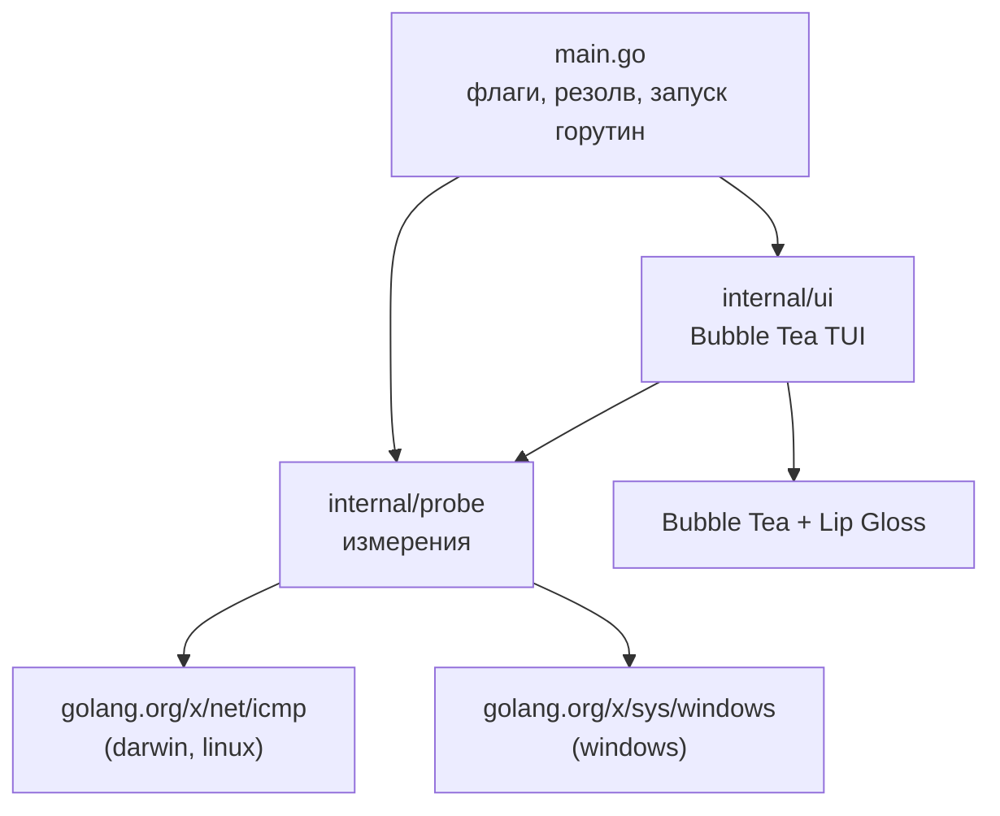
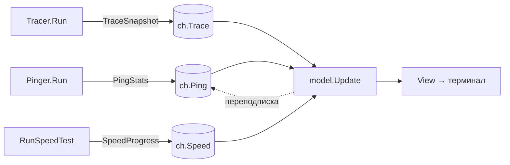
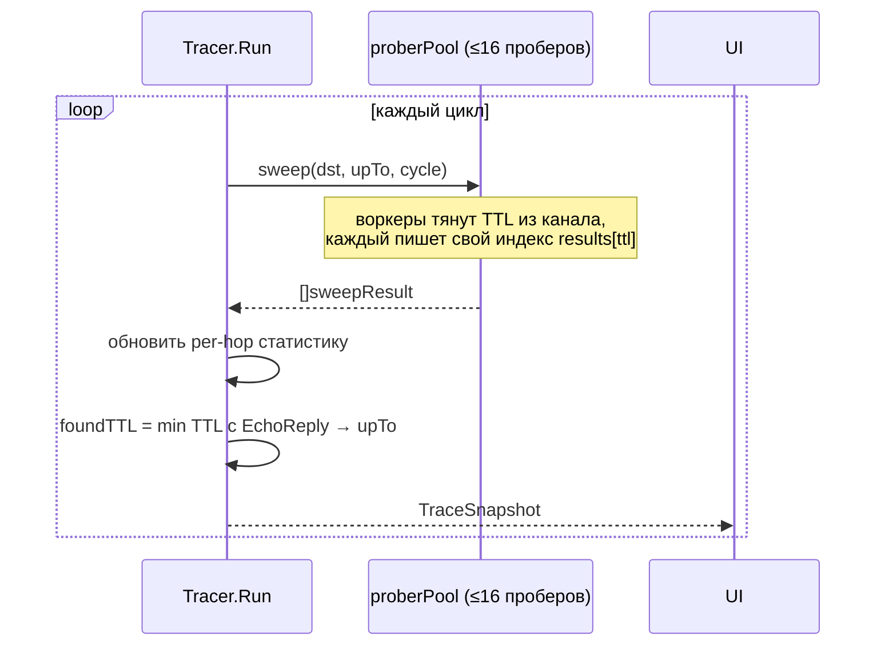

# Архитектура net-test

Технический обзор: структура кода, модель конкуренции, платформенный шов ICMP и
внутренности каждого измерителя. Пользовательская часть — в [README](../README.md).

## Принципы

1. **Сетевой слой не знает про UI.** `internal/probe` производит снапшоты
   (`PingStats`, `TraceSnapshot`, `SpeedProgress`) и шлёт их в каналы. Он не
   импортирует ничего из `internal/ui`. Это позволяет переиспользовать его в
   другом фронтенде (например, `gomobile`).
2. **Один платформенный шов.** Всё, что зависит от ОС, спрятано за интерфейсом
   `prober`. Остальной код собирается под любую платформу без правок.
3. **Без внешних бинарников и без root.** ICMP делается напрямую: unprivileged
   datagram-сокет на macOS/Linux, Win32-API `iphlpapi` на Windows. `os/exec`,
   `ping`, `traceroute` не используются.
4. **Ошибки не глотаются.** Сбой измерителя кладётся в поле `Err` снапшота и
   рисуется в соответствующей вкладке, а не роняет процесс.

## Структура пакетов



Направление зависимостей строго одностороннее: `main → {ui, probe}`, `ui → probe`.
`probe` не зависит ни от чего внутреннего.

```
internal/probe/
  prober.go          # интерфейс prober + типы (нейтральный)
  prober_posix.go    # //go:build darwin || linux — udp4-сокет
  prober_windows.go  # //go:build windows — iphlpapi.IcmpSendEcho
  ping.go            # Pinger: монитор RTT/потерь/джиттера
  trace.go           # Tracer: mtr-стиль + пул проберов
  speed.go           # RunSpeedTest: Cloudflare down/up/latency
  live_test.go       # живой сетевой тест (gated NETTEST_LIVE)
internal/ui/
  model.go           # модель Bubble Tea, Update, каналы
  views.go           # рендер трёх вкладок
  styles.go          # палитра, спарклайн, бары, хелперы
  render_test.go     # smoke-тесты рендера (+ NETTEST_SNAPSHOT)
main.go
```

## Модель конкуренции

`Pinger.Run`, `Tracer.Run` и `RunSpeedTest` работают в отдельных горутинах и
пишут снапшоты в буферизованные каналы. UI — однопоточный цикл Bubble Tea (Elm-
архитектура): команда `waitX` блокируется на `<-ch`, превращает значение в
`tea.Msg`, а `Update` после обработки переподписывается тем же `waitX`.



Каналы намеренно **не закрываются**: горутины живут весь сеанс, а `tea` снимает
свои команды при выходе. `emit()` ([ping.go](../internal/probe/ping.go)) — дженерик-
хелпер, который пишет в канал, но прерывается по `ctx.Done()`.

## Платформенный шов: `prober`

```go
type prober interface {
    probe(dst net.IP, ttl, seq int, timeout time.Duration) (probeResult, bool, error)
    close() error
}
func newProber() (prober, error) // своя реализация под каждый GOOS
```

`probe` синхронна: «отправь один echo с данным TTL, верни ответ или таймаут». Это
естественная модель и для Unix (send + read-match), и для Windows (request/reply
API). `ok == false` означает таймаут.

| | macOS / Linux / Android | Windows |
|---|---|---|
| Файл | `prober_posix.go` | `prober_windows.go` |
| Build tag | `darwin \|\| linux` | `windows` |
| Сокет/API | `icmp.ListenPacket("udp4", …)` (SOCK_DGRAM+IPPROTO_ICMP) | `iphlpapi.IcmpSendEcho` |
| Права | без root | без админки |
| TTL | `ipv4.PacketConn.SetTTL` | `IP_OPTION_INFORMATION.Ttl` |
| Матчинг ответа | по sequence-номеру¹ | сам API (request/reply) |

¹ На Darwin ядро переписывает ICMP ID на порт сокета, поэтому ID ненадёжен —
матчим по seq. Для `Time Exceeded`/`Unreachable` seq достаётся из вложенного
исходного пакета (`innerSeq`).

> На Windows датаграммный ICMP-сокет не поддерживается ОС (`x/net/icmp` явно
> ограничивает этот режим Darwin и Linux), поэтому используется `iphlpapi` — тот
> же API, что у `ping.exe`/`tracert.exe`. Структуры `ICMP_ECHO_REPLY` и
> `IP_OPTION_INFORMATION` выверены по C-layout для 386 и amd64.

## Пинг (`ping.go`)

`Pinger.Run` раз в `interval` шлёт один echo с TTL 64 и ждёт ответ до `timeout`:

- **Потери:** `(Sent − Recv) / Sent`.
- **Джиттер** (RFC 3550, межпакетный): `J += (|RTTᵢ − RTTᵢ₋₁| − J) / 16`,
  обновляется только на успешных последовательных пробах.
- **История:** кольцо из последних 120 значений (мс), `0` = потеря; копируется при
  каждом `emit`, т.к. UI читает её из своей горутины.

## Трассировка (`trace.go`)

mtr-стиль: каждый цикл пингуются все хопы `TTL = 1..upTo`, статистика
накапливается между циклами.



- **Параллелизм:** `proberPool` держит до `traceConcurrency` (16) проберов; каждый
  используется одной горутиной за раз. Воркеры разбирают TTL из канала, и каждый
  пишет в **свой** индекс `results[ttl]` — поэтому без гонок (проверено `-race`).
  Время цикла ≈ самый медленный хоп, а не сумма.
- **Длина маршрута:** как только цель ответила `EchoReply` на каком-то TTL, `upTo`
  фиксируется на нём (дальше не зондируем).
- **СКО:** инкрементально через сумму и сумму квадратов:
  `σ = √(Σx²/n − (Σx/n)²)` (с клампом отрицательной дисперсии в 0).
- **Reverse DNS:** `dnsCache` резолвит IP хопов в фоне с таймаутом 2 с; пробы
  никогда не блокируются на DNS.

## Скорость (`speed.go`)

Открытые endpoint'ы Cloudflare (без ключей):

| Фаза | Endpoint | Как считается |
|---|---|---|
| Латентность | `__down?bytes=0` | TTFB через `httptrace.GotFirstResponseByte`; 14 проб, первые 2 (прогрев TLS/TCP) отбрасываются; джиттер = СКО |
| Download ↓ | `__down?bytes=50000000` | 4 параллельных потока 8 с, чанк 50 МБ (Cloudflare режет ≥100 МБ) |
| Upload ↑ | `__up` (POST) | 3 параллельных потока 8 с, тело генерится на лету |

Пропускная способность: `Mbps = bytes·8 / elapsed / 1e6`. Прогресс эмитится раз в
250 мс через тикер; фаза прерывается по `context` с таймаутом окна. Датацентр CF и
внешний IP берутся из `cdn-cgi/trace`.

## Как добавить платформенный бэкенд

1. Создать `prober_<os>.go` с build-тегом нужной платформы.
2. Реализовать `type xProber struct{…}` с методами `probe` и `close`, плюс
   `func newProber() (prober, error)`.
3. Проверить: `GOOS=<os> go build ./...`, затем рантайм через
   `NETTEST_LIVE=1 go test -run Live ./internal/probe`.

`ping.go`, `trace.go`, `speed.go` и UI трогать не нужно.

## Тестирование

| Команда | Что проверяет |
|---|---|
| `make test` | рендер всех вкладок без сети ([render_test.go](../internal/ui/render_test.go)) |
| `make test-race` | то же под детектором гонок |
| `make live` | живой пинг+трасса одновременно, корректность демукса сокетов |
| `NETTEST_SNAPSHOT=1 go test -run Snapshot ./internal/ui -v` | печать кадров TUI |

Кросс-сборка под все платформы (`make dist`) служит компайл-тайм проверкой
платформенных бэкендов.
