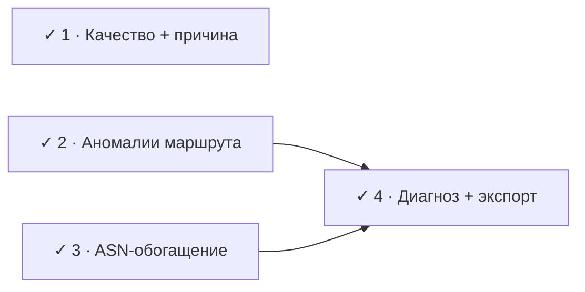

# Roadmap

Направление: **от сырых метрик к понятному диагнозу**. Исходные четыре фазы
(качество → аномалии → ASN → диагноз) **выполнены** — net-test не просто
показывает числа, а говорит «что не так и где». Ниже: что сделано и что в бэклоге.

## Принципы

- **Persistent, не transient.** Роутеры рейт-лимитят генерацию ICMP, поэтому
  одиночный спайк/потеря на промежуточном хопе — обычно косметика. Реальная
  проблема — потери или задержка, которые *начинаются на хопе N и держатся до
  конца маршрута*. Вся аналитика опирается на это различие.
- **Относительный RTT, не абсолютный.** 80 ms до далёкого сервера — норма.
  Качество оценивается по стабильности (джиттер, потери) и отклонению от baseline
  сессии, а не по абсолютному порогу.
- **Без тяжёлых зависимостей.** Обогащение (ASN, гео) — через DNS и публичные
  сервисы, в духе текущего ICMP/Cloudflare-подхода.
- **Сетевой слой остаётся UI-агностичным.** Аналитика живёт в `internal/probe` и
  отдаётся в UI снапшотами; рендер — в `internal/ui`.
- **Совместимость терминала.** Цвет — через lipgloss; эмодзи опциональны (legacy-
  консоли Windows).

## Сделано

- **Фаза 1 · Уровни качества + причина** — `verdict()` в [styles.go](../internal/ui/styles.go):
  4 уровня (Отлично / Хорошо / Плохо / Критично), severity = максимум по факторам,
  причина (`Качество: Плохо (потери 3.2%)`). Считается по **скользящему окну**, а
  не за сессию.
- **Фаза 2 · Аномалии маршрута** — [anomaly.go](../internal/probe/anomaly.go):
  `markAnomalies` помечает `⚠` и показывает `+ΔX`, но только при persistent-проблеме
  (потери/задержка держатся до конца маршрута), игнорируя одиночные спайки rate-limit.
- **Фаза 3 · ASN-обогащение** — [asn.go](../internal/probe/asn.go): AS-имя у каждого
  хопа через Team Cymru DNS, фоном, с кэшем и TTL на неудачи.
- **Фаза 4 · Диагноз + экспорт** — [diagnosis.go](../internal/probe/diagnosis.go)
  сегментирует маршрут на зоны (локалка → провайдер → транзит → назначение) с
  вердиктом по каждой; вкладка «Диагноз» + one-shot `--once`/`--json`
  ([internal/report](../internal/report)) для тикетов провайдеру и cron.
- **Android-приложение** — GUI на [Fyne](https://fyne.io) ([mobile/app](../mobile/app))
  поверх того же `internal/probe`: `make apk` собирает APK без Android Studio,
  `make gui` гоняет его десктоп-окном. ICMP работает тем же unprivileged-путём
  (проверено на устройстве). Bubble Tea остаётся для терминала, Fyne — для
  мобильного экрана; ядро не дублируется.

## Бэклог

- **IPv6** (ICMPv6) — сейчас только IPv4.
- **Многострочный график истории RTT** на braille (расширение текущего спарклайна).
- **Логирование / CSV** для долгого мониторинга обрывов; **порог-алерты**
  (звук/`notify-send` при потере связи).
- **Отслеживание смены маршрута** на лету (сейчас `upTo` фиксируется на цели).
- **Нативный Android UI на Kotlin** (`gomobile bind`) — опционально: Android уже
  закрыт Fyne-приложением, но JSON-фасад поверх `probe` можно вернуть, если
  понадобится родной UI.
- **Сохранение избранных целей / конфиг.**

---

Идеи и предложения — через [issues](https://github.com/tavvet/net-test/issues).
