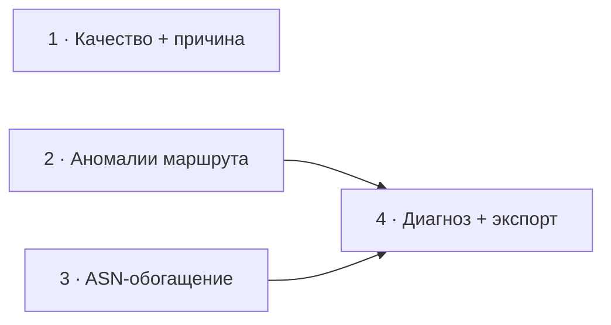

# Roadmap

Направление: **от сырых метрик к понятному диагнозу**. net-test уже измеряет
задержку, потери, джиттер, маршрут и скорость — дальнейшее развитие идёт в сторону
интерпретации: не просто числа, а «что не так и где».

## Принципы

- **Persistent, не transient.** Роутеры рейт-лимитят генерацию ICMP, поэтому
  одиночный спайк/потеря на промежуточном хопе — обычно косметика. Реальная
  проблема — потери или задержка, которые *начинаются на хопе N и держатся до
  конца маршрута*. Вся аналитика опирается на это различие.
- **Относительный RTT, не абсолютный.** 80 ms до далёкого сервера — норма.
  Качество оценивается по стабильности (джиттер, потери) и отклонению от baseline
  сессии, а не по абсолютному порогу.
- **Без тяжёлых зависимостей.** Обогащение (ASN, гео) — через DNS и публичные
  сервисы, в духе текущего ICMP/Cloudflare-подхода.
- **Сетевой слой остаётся UI-агностичным.** Аналитика живёт в `internal/probe` и
  отдаётся в UI снапшотами; рендер — в `internal/ui`.
- **Совместимость терминала.** Цвет — через lipgloss; эмодзи опциональны (legacy-
  консоли Windows).

## Фазы



### Фаза 1 · Уровни качества + причина · S

Четыре уровня (Отлично / Хорошо / Плохо / Критично), severity = максимум по
факторам (потери, джиттер), и **причина** в вердикте:
`Качество: Плохо (потери 3.2%)`. Рефактор `verdict()` в `internal/ui`.

### Фаза 2 · Аномалии маршрута · M

Подсветка проблемного узла на вкладке «Маршрут»: Δ задержки к предыдущему хопу и
флаг при потерях/росте RTT, **которые сохраняются до конца маршрута** (persistent,
а не разовый спайк). Один проход по хопам; в таблице — инлайн-маркер `⚠`/`Δ` на
флагнутых строках.

### Фаза 3 · ASN-обогащение · M

AS-номер и имя у каждого хопа через Team Cymru DNS
(`<rev-ip>.origin.asn.cymru.com` → ASN, `AS<n>.asn.cymru.com` → имя), фоном и с
кэшем — как reverse-DNS. Само по себе улучшает «Маршрут» и служит основой фазы 4.

### Фаза 4 · Диагноз для пользователя + экспорт · L

Сегментация маршрута по ASN на зоны (локалка по RFC1918 → провайдер → транзит/CDN)
и человекочитаемый вердикт по каждой:

```
Диагноз:
  ✓ Локальная сеть исправна
  ✓ Провайдер отвечает стабильно
  ⚠ Скачки задержки в сети Cloudflare (AS13335)
```

Опирается на persistent-логику фазы 2 (иначе — ложные обвинения не по адресу).
Плюс one-shot `net-test --once --json` / текстовый отчёт, чтобы вложить диагноз в
тикет провайдеру.

**Зависимости:** фаза 4 ← фазы 2 + 3; фазы 2 и 3 независимы.

## Бэклог

- Многострочный график истории RTT на braille (полная версия текущего спарклайна).
- IPv6 (ICMPv6).
- Логирование / CSV для долгого мониторинга обрывов; порог-алерты.
- `gomobile`-адаптер + нативный Android UI (`internal/probe` уже готов к bind).
- Сохранение избранных целей / конфиг.

---

Идеи и предложения — через [issues](https://github.com/tavvet/net-test/issues).
